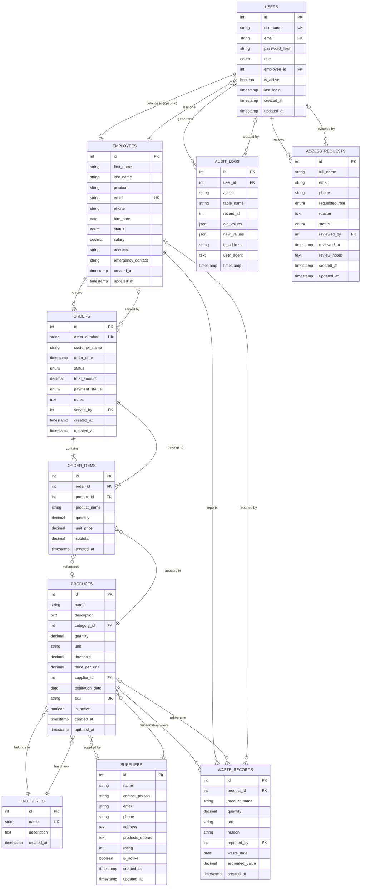

# ServUp V2 - Entity Relationship Diagram (ERD)

## Visual ERD Diagram

This diagram shows all entities, their attributes, and relationships in the ServUp database.



## Relationship Summary

### One-to-One (Optional)
- **USERS ↔ EMPLOYEES**: A user account can optionally be linked to an employee record via `employee_id`

### One-to-Many Relationships

1. **CATEGORIES → PRODUCTS** (1:N)
   - One category can have many products
   - Foreign Key: `products.category_id` → `categories.id`

2. **SUPPLIERS → PRODUCTS** (1:N)
   - One supplier can supply many products
   - Foreign Key: `products.supplier_id` → `suppliers.id`

3. **EMPLOYEES → ORDERS** (1:N)
   - One employee can serve many orders
   - Foreign Key: `orders.served_by` → `employees.id`

4. **ORDERS → ORDER_ITEMS** (1:N)
   - One order contains many order items
   - Foreign Key: `order_items.order_id` → `orders.id`
   - **CASCADE DELETE**: Deleting an order deletes all its items

5. **PRODUCTS → ORDER_ITEMS** (1:N)
   - One product can appear in many order items
   - Foreign Key: `order_items.product_id` → `products.id`
   - **Note**: `product_id` can be NULL if product is deleted (snapshot stored in `product_name`)

6. **PRODUCTS → WASTE_RECORDS** (1:N)
   - One product can have many waste records
   - Foreign Key: `waste_records.product_id` → `products.id`

7. **EMPLOYEES → WASTE_RECORDS** (1:N)
   - One employee can report many waste records
   - Foreign Key: `waste_records.reported_by` → `employees.id`

8. **USERS → AUDIT_LOGS** (1:N)
   - One user generates many audit log entries
   - Foreign Key: `audit_logs.user_id` → `users.id`
   - **Note**: `user_id` can be NULL for system-generated logs

9. **USERS → ACCESS_REQUESTS** (1:N)
   - One user (admin) can review many access requests
   - Foreign Key: `access_requests.reviewed_by` → `users.id`
   - **Note**: `reviewed_by` can be NULL for pending requests

## Key Constraints

### Primary Keys (PK)
- All tables have an auto-incrementing integer `id` as primary key

### Unique Keys (UK)
- `users.username`
- `users.email`
- `employees.email`
- `categories.name`
- `products.sku`
- `orders.order_number`
- `access_requests.email` (indexed, not unique)

### Foreign Keys (FK)
- All foreign key relationships are defined above
- Most foreign keys allow NULL values for flexibility
- `order_items.order_id` is NOT NULL (required)
- `order_items.product_id` can be NULL (product may be deleted)

### Data Integrity Rules

1. **Cascading Deletes**:
   - Deleting an `order` automatically deletes all associated `order_items`

2. **Soft Deletes**:
   - `users.is_active` flag (instead of hard delete)
   - `products.is_active` flag (instead of hard delete)
   - `suppliers.is_active` flag (instead of hard delete)
   - `employees.status` enum (active, inactive, on_leave)

3. **Data Validation**:
   - `products.quantity` >= 0
   - `suppliers.rating` between 1-5
   - `order_items.subtotal` = `quantity` × `unit_price` (auto-calculated)
   - `orders.total_amount` should equal sum of `order_items.subtotal`

4. **Snapshot Fields**:
   - `order_items.product_name` - stores product name at time of order
   - `waste_records.product_name` - stores product name at time of waste report

## Entity Descriptions

### Core Entities

- **USERS**: System authentication and authorization
- **EMPLOYEES**: Restaurant staff information
- **CATEGORIES**: Product classification
- **SUPPLIERS**: Vendor information
- **PRODUCTS**: Inventory items (stock)

### Transaction Entities

- **ORDERS**: Customer orders
- **ORDER_ITEMS**: Line items within orders

### Tracking Entities

- **WASTE_RECORDS**: Product waste/loss tracking
- **AUDIT_LOGS**: System activity and security logging
- **ACCESS_REQUESTS**: User access request management and approval workflow

---

---

## Alternative ERD Formats

### For dbdiagram.io (https://dbdiagram.io/)

Copy and paste this code into dbdiagram.io to generate a visual ERD:

```dbml
Table users {
  id integer [primary key, increment]
  username varchar(50) [unique, not null]
  email varchar(100) [unique, not null]
  password_hash varchar(255) [not null]
  role enum [not null]
  employee_id integer [ref: > employees.id]
  is_active boolean [default: true]
  last_login timestamp
  created_at timestamp [default: `CURRENT_TIMESTAMP`]
  updated_at timestamp [default: `CURRENT_TIMESTAMP`]
}

Table employees {
  id integer [primary key, increment]
  first_name varchar(50) [not null]
  last_name varchar(50) [not null]
  position varchar(100) [not null]
  email varchar(100) [unique]
  phone varchar(20)
  hire_date date [not null]
  status enum [not null, default: 'active']
  salary decimal(10,2)
  address varchar(255)
  emergency_contact varchar(255)
  created_at timestamp [default: `CURRENT_TIMESTAMP`]
  updated_at timestamp [default: `CURRENT_TIMESTAMP`]
}

Table categories {
  id integer [primary key, increment]
  name varchar(100) [unique, not null]
  description text
  created_at timestamp [default: `CURRENT_TIMESTAMP`]
}

Table suppliers {
  id integer [primary key, increment]
  name varchar(150) [not null]
  contact_person varchar(100)
  email varchar(100)
  phone varchar(20)
  address text
  products_offered text
  rating integer
  is_active boolean [default: true]
  created_at timestamp [default: `CURRENT_TIMESTAMP`]
  updated_at timestamp [default: `CURRENT_TIMESTAMP`]
}

Table products {
  id integer [primary key, increment]
  name varchar(150) [not null]
  description text
  category_id integer [ref: > categories.id]
  quantity decimal(10,2) [not null, default: 0]
  unit varchar(20) [not null]
  threshold decimal(10,2) [default: 10]
  price_per_unit decimal(10,2)
  supplier_id integer [ref: > suppliers.id]
  expiration_date date
  sku varchar(50) [unique]
  is_active boolean [default: true]
  created_at timestamp [default: `CURRENT_TIMESTAMP`]
  updated_at timestamp [default: `CURRENT_TIMESTAMP`]
}

Table orders {
  id integer [primary key, increment]
  order_number varchar(50) [unique, not null]
  customer_name varchar(100) [not null]
  order_date timestamp [default: `CURRENT_TIMESTAMP`]
  status enum [not null]
  total_amount decimal(10,2) [not null, default: 0]
  payment_status enum [not null]
  notes text
  served_by integer [ref: > employees.id]
  created_at timestamp [default: `CURRENT_TIMESTAMP`]
  updated_at timestamp [default: `CURRENT_TIMESTAMP`]
}

Table order_items {
  id integer [primary key, increment]
  order_id integer [ref: > orders.id, not null]
  product_id integer [ref: > products.id]
  product_name varchar(150) [not null]
  quantity decimal(10,2) [not null]
  unit_price decimal(10,2) [not null]
  subtotal decimal(10,2) [not null]
  created_at timestamp [default: `CURRENT_TIMESTAMP`]
}

Table waste_records {
  id integer [primary key, increment]
  product_id integer [ref: > products.id]
  product_name varchar(150) [not null]
  quantity decimal(10,2) [not null]
  unit varchar(20) [not null]
  reason varchar(255)
  reported_by integer [ref: > employees.id]
  waste_date date [not null]
  estimated_value decimal(10,2)
  created_at timestamp [default: `CURRENT_TIMESTAMP`]
}

Table audit_logs {
  id integer [primary key, increment]
  user_id integer [ref: > users.id]
  action varchar(100) [not null]
  table_name varchar(50)
  record_id integer
  old_values json
  new_values json
  ip_address varchar(45)
  user_agent text
  timestamp timestamp [default: `CURRENT_TIMESTAMP`]
}

Table access_requests {
  id integer [primary key, increment]
  full_name varchar(100) [not null]
  email varchar(100) [not null]
  phone varchar(20)
  requested_role enum [not null, default: 'employe']
  reason text
  status enum [not null, default: 'pending']
  reviewed_by integer [ref: > users.id]
  reviewed_at timestamp
  review_notes text
  created_at timestamp [default: `CURRENT_TIMESTAMP`]
  updated_at timestamp [default: `CURRENT_TIMESTAMP`]
}
```

### For Draw.io / Lucidchart

When creating the ERD in draw.io or Lucidchart:

1. **Use Entity Relationship template** (File → New → Software → Entity Relationship)
2. **Add all 10 entities** as rectangles
3. **Add attributes** inside each entity:
   - Primary keys (PK) at the top, underlined
   - Foreign keys (FK) marked with asterisk (*)
   - Regular attributes below
4. **Connect relationships** using lines:
   - **One-to-Many (1:N)**: Use crow's foot notation (many side has three lines)
   - **One-to-One (1:1)**: Use single line on both sides
   - **Optional**: Use circle (O) on optional side
   - **Required**: Use line (|) on required side
5. **Label relationships** with descriptive names

**Relationship Labels:**
- `users` ←→ `employees`: "linked to" (1:1, optional)
- `categories` → `products`: "categorizes" (1:N)
- `suppliers` → `products`: "supplies" (1:N)
- `employees` → `orders`: "serves" (1:N)
- `orders` → `order_items`: "contains" (1:N)
- `products` → `order_items`: "appears in" (1:N, optional)
- `products` → `waste_records`: "has waste" (1:N, optional)
- `employees` → `waste_records`: "reports" (1:N, optional)
- `users` → `audit_logs`: "generates" (1:N, optional)
- `users` → `access_requests`: "reviews" (1:N, optional)

---

**Version:** 1.1  
**Last Updated:** November 2024  
**Author:** ServUp Development Team

**Note:** This ERD includes all 10 tables in the ServUp v2.0 database schema. The Mermaid diagram above can be rendered in GitHub, GitLab, or any Mermaid-compatible viewer. For visual diagramming, use the dbdiagram.io code or create manually in draw.io/Lucidchart.


