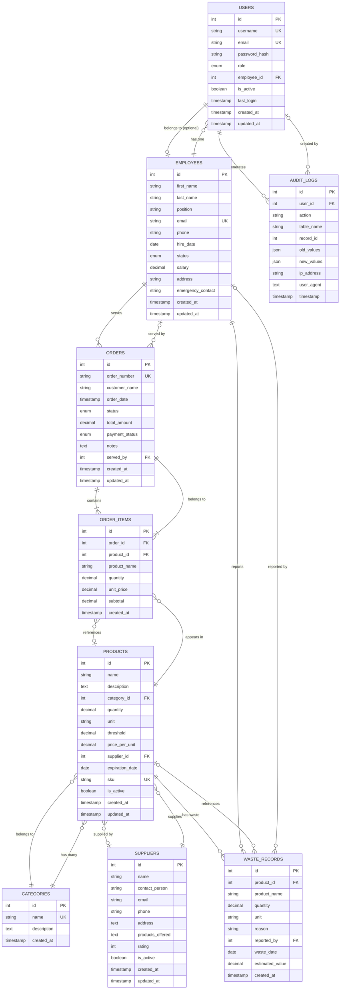

# ServUp V2 - Entity Relationship Diagram (ERD)

## Visual ERD Diagram

This diagram shows all entities, their attributes, and relationships in the ServUp database.

## Relationship Summary

### One-to-One (Optional)
- **USERS ↔ EMPLOYEES**: A user account can optionally be linked to an employee record via `employee_id`

### One-to-Many Relationships

1. **CATEGORIES → PRODUCTS** (1:N)
   - One category can have many products
   - Foreign Key: `products.category_id` → `categories.id`

2. **SUPPLIERS → PRODUCTS** (1:N)
   - One supplier can supply many products
   - Foreign Key: `products.supplier_id` → `suppliers.id`

3. **EMPLOYEES → ORDERS** (1:N)
   - One employee can serve many orders
   - Foreign Key: `orders.served_by` → `employees.id`

4. **ORDERS → ORDER_ITEMS** (1:N)
   - One order contains many order items
   - Foreign Key: `order_items.order_id` → `orders.id`
   - **CASCADE DELETE**: Deleting an order deletes all its items

5. **PRODUCTS → ORDER_ITEMS** (1:N)
   - One product can appear in many order items
   - Foreign Key: `order_items.product_id` → `products.id`
   - **Note**: `product_id` can be NULL if product is deleted (snapshot stored in `product_name`)

6. **PRODUCTS → WASTE_RECORDS** (1:N)
   - One product can have many waste records
   - Foreign Key: `waste_records.product_id` → `products.id`

7. **EMPLOYEES → WASTE_RECORDS** (1:N)
   - One employee can report many waste records
   - Foreign Key: `waste_records.reported_by` → `employees.id`

8. **USERS → AUDIT_LOGS** (1:N)
   - One user generates many audit log entries
   - Foreign Key: `audit_logs.user_id` → `users.id`
   - **Note**: `user_id` can be NULL for system-generated logs

## Key Constraints

### Primary Keys (PK)
- All tables have an auto-incrementing integer `id` as primary key

### Unique Keys (UK)
- `users.username`
- `users.email`
- `employees.email`
- `categories.name`
- `products.sku`
- `orders.order_number`

### Foreign Keys (FK)
- All foreign key relationships are defined above
- Most foreign keys allow NULL values for flexibility
- `order_items.order_id` is NOT NULL (required)
- `order_items.product_id` can be NULL (product may be deleted)

### Data Integrity Rules

1. **Cascading Deletes**:
   - Deleting an `order` automatically deletes all associated `order_items`

2. **Soft Deletes**:
   - `users.is_active` flag (instead of hard delete)
   - `products.is_active` flag (instead of hard delete)
   - `suppliers.is_active` flag (instead of hard delete)
   - `employees.status` enum (active, inactive, on_leave)

3. **Data Validation**:
   - `products.quantity` >= 0
   - `suppliers.rating` between 1-5
   - `order_items.subtotal` = `quantity` × `unit_price` (auto-calculated)
   - `orders.total_amount` should equal sum of `order_items.subtotal`

4. **Snapshot Fields**:
   - `order_items.product_name` - stores product name at time of order
   - `waste_records.product_name` - stores product name at time of waste report

## Entity Descriptions

### Core Entities

- **USERS**: System authentication and authorization
- **EMPLOYEES**: Restaurant staff information
- **CATEGORIES**: Product classification
- **SUPPLIERS**: Vendor information
- **PRODUCTS**: Inventory items (stock)

### Transaction Entities

- **ORDERS**: Customer orders
- **ORDER_ITEMS**: Line items within orders

### Tracking Entities

- **WASTE_RECORDS**: Product waste/loss tracking
- **AUDIT_LOGS**: System activity and security logging

---

**Version:** 1.0  
**Last Updated:** December 2024  
**Author:** ServUp Development Team

