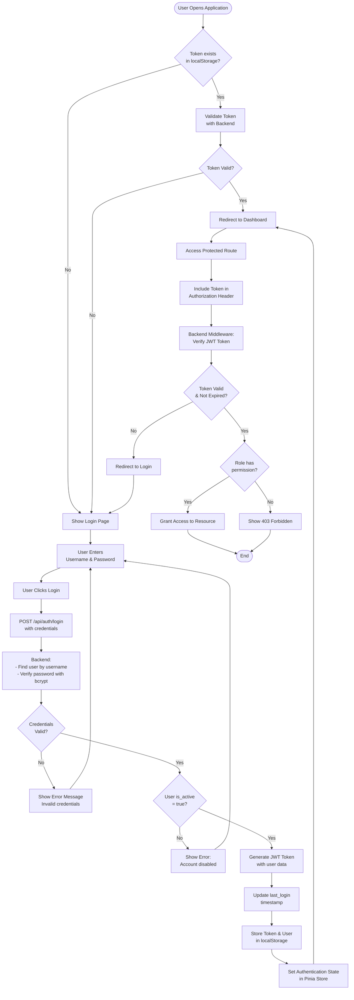
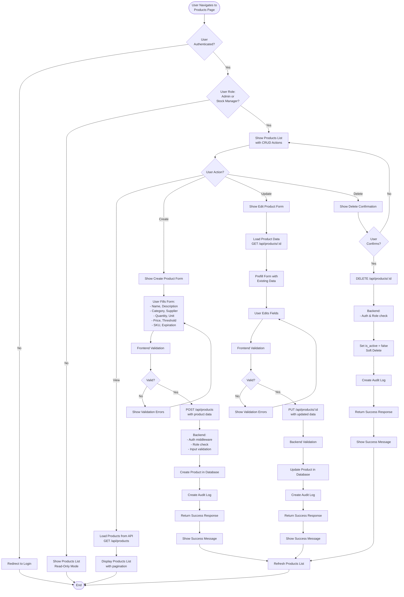
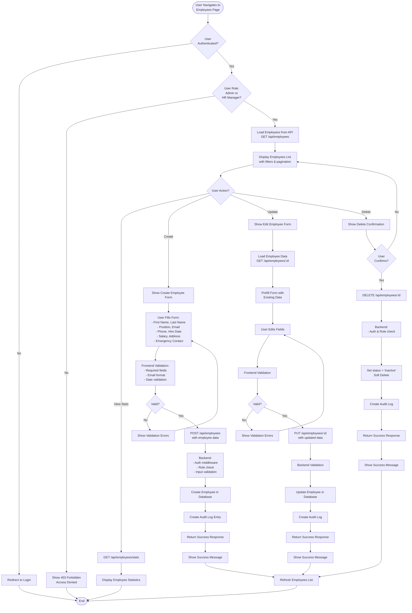
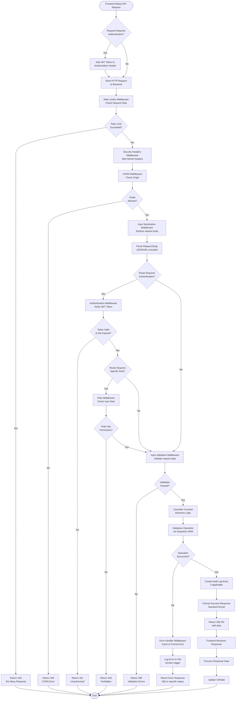
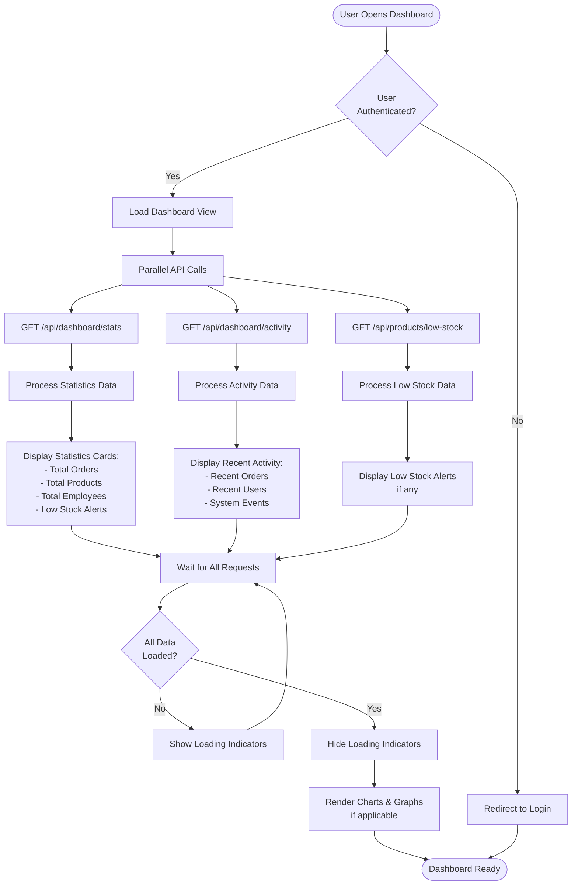

# ServUp V2 - System Flowcharts

This document contains flowcharts for all major workflows in the ServUp v2.0 system. These diagrams can be rendered using Mermaid-compatible viewers or exported to visual diagramming tools.

---

## 1. Authentication & Login Flow

This flowchart shows the complete user authentication process using JWT tokens.

---

## 2. Order Creation Flow

This flowchart shows the complete process of creating a new order in the system.

```mermaid
flowchart TD
    Start([User Navigates to<br/>Orders Page]) --> CheckAuth{User<br/>Authenticated?}
    
    CheckAuth -->|No| RedirectLogin[Redirect to Login]
    CheckAuth -->|Yes| LoadProducts[Load Available Products<br/>from API]
    
    LoadProducts --> DisplayForm[Display Order Creation Form]
    
    DisplayForm --> EnterCustomer[User Enters:<br/>- Customer Name<br/>- Table Number]
    
    EnterCustomer --> AddItems[User Adds Items:<br/>- Select Product<br/>- Enter Quantity]
    
    AddItems --> CalculateTotal[Calculate Order Total:<br/>Sum of item subtotals]
    
    CalculateTotal --> DisplayTotal[Display Total Amount]
    
    DisplayTotal --> MoreItems{Add More<br/>Items?}
    
    MoreItems -->|Yes| AddItems
    MoreItems -->|No| ReviewOrder[Review Order Details]
    
    ReviewOrder --> SubmitOrder{Click<br/>Submit?}
    
    SubmitOrder -->|Cancel| DisplayForm
    SubmitOrder -->|Yes| ValidateForm[Frontend Validation:<br/>- Customer name required<br/>- At least one item<br/>- Quantities > 0]
    
    ValidateForm --> ValidationPass{Validation<br/>Passed?}
    
    ValidationPass -->|No| ShowErrors[Show Validation Errors]
    ShowErrors --> ReviewOrder
    
    ValidationPass -->|Yes| APICall[POST /api/orders<br/>with order data]
    
    APICall --> BackendValidate[Backend Validation:<br/>- Auth middleware<br/>- Input validation]
    
    BackendValidate --> CreateOrder[Create Order Record<br/>in Database]
    
    CreateOrder --> GenerateOrderNum[Generate Order Number<br/>CMD001, CMD002, etc.]
    
    GenerateOrderNum --> CreateItems[Create Order Items:<br/>For each item in order]
    
    CreateItems --> UpdateInventory{Update Product<br/>Inventory?}
    
    UpdateInventory -->|Yes| DecrementStock[Decrement Product Quantity<br/>in products table]
    
    DecrementStock --> CheckLowStock{Quantity <=<br/>Threshold?}
    
    CheckLowStock -->|Yes| LogLowStock[Log Low Stock Alert]
    
    CheckLowStock -->|No| CalculateOrderTotal
    UpdateInventory -->|No| CalculateOrderTotal
    
    CalculateOrderTotal[Calculate Total Amount<br/>from order items]
    
    CalculateOrderTotal --> UpdateOrderTotal[Update order.total_amount]
    
    UpdateOrderTotal --> AuditLog[Create Audit Log Entry]
    
    AuditLog --> ReturnSuccess[Return Success Response<br/>with order data]
    
    ReturnSuccess --> ShowSuccess[Show Success Message<br/>Order Created!]
    
    ShowSuccess --> RefreshList[Refresh Orders List]
    
    RefreshList --> End([End])
    
    RedirectLogin --> End
```

---

## 3. Product Management Flow

This flowchart shows the workflow for managing products (create, update, delete) with role-based access control.

---

## 4. Employee Management Flow

This flowchart shows the workflow for managing employees, accessible only to Admin and HR Manager roles.

---

## 5. Access Request Approval Flow

This flowchart shows the workflow for handling access requests from new users.

```mermaid
flowchart TD
    Start([New User Wants Access]) --> PublicForm[Public Access Request Form<br/>POST /api/access-requests]
    
    PublicForm --> FillRequest[User Fills Request:<br/>- Full Name<br/>- Email, Phone<br/>- Requested Role<br/>- Reason]
    
    FillRequest --> ValidateRequest[Frontend Validation]
    
    ValidateRequest --> ValidationPass{Valid?}
    
    ValidationPass -->|No| ShowErrors[Show Validation Errors]
    ShowErrors --> FillRequest
    
    ValidationPass -->|Yes| SubmitRequest[Submit Access Request]
    
    SubmitRequest --> CreateRequest[Create Request in Database<br/>status = 'pending']
    
    CreateRequest --> ShowThankYou[Show Thank You Message<br/>Request Submitted]
    
    ShowThankYou --> NotifyAdmin[Admin Notification<br/>New Request Available]
    
    NotifyAdmin --> AdminLogin[Admin Logs In]
    
    AdminLogin --> CheckRequests[Admin Checks<br/>Pending Requests<br/>GET /api/access-requests]
    
    CheckRequests --> DisplayRequests[Display Pending Requests List]
    
    DisplayRequests --> SelectRequest[Admin Selects Request]
    
    SelectRequest --> ReviewDetails[Review Request Details:<br/>- Full Name, Email<br/>- Requested Role<br/>- Reason]
    
    ReviewDetails --> AdminDecision{Admin Decision?}
    
    AdminDecision -->|Approve| ShowApproveForm[Show Approval Form]
    AdminDecision -->|Deny| ShowDenyForm[Show Denial Form]
    AdminDecision -->|Pending| DisplayRequests
    
    ShowApproveForm --> EnterNotes[Admin Enters Review Notes<br/>Optional]
    
    EnterNotes --> ConfirmApprove{Confirm<br/>Approval?}
    
    ConfirmApprove -->|Cancel| ReviewDetails
    ConfirmApprove -->|Yes| APIApprove[PUT /api/access-requests/:id/approve]
    
    APIApprove --> UpdateStatus[Update Request:<br/>- status = 'approved'<br/>- reviewed_by = admin_id<br/>- reviewed_at = now<br/>- review_notes]
    
    UpdateStatus --> CreateUser[Create User Account:<br/>- username from email<br/>- password from request<br/>- role = requested_role]
    
    CreateUser --> HashPassword[Hash Password with bcrypt]
    
    HashPassword --> SaveUser[Save User to Database]
    
    SaveUser --> AuditLog[Create Audit Log Entry]
    
    AuditLog --> NotifyUser[Notify User<br/>Account Created]
    
    NotifyUser --> ShowSuccess[Show Success Message<br/>Request Approved]
    
    ShowSuccess --> RefreshList[Refresh Requests List]
    
    RefreshList --> End([End])
    
    ShowDenyForm --> EnterDenyNotes[Admin Enters Denial Reason]
    
    EnterDenyNotes --> ConfirmDeny{Confirm<br/>Denial?}
    
    ConfirmDeny -->|Cancel| ReviewDetails
    ConfirmDeny -->|Yes| APIDeny[PUT /api/access-requests/:id/deny]
    
    APIDeny --> UpdateStatusDeny[Update Request:<br/>- status = 'denied'<br/>- reviewed_by = admin_id<br/>- reviewed_at = now<br/>- review_notes]
    
    UpdateStatusDeny --> AuditLog2[Create Audit Log Entry]
    
    AuditLog2 --> NotifyUserDeny[Notify User<br/>Request Denied]
    
    NotifyUserDeny --> ShowDenied[Show Message<br/>Request Denied]
    
    ShowDenied --> RefreshList
```

---

## 6. System Request Flow (API Call)

This flowchart shows the general flow of any API request through the system, including middleware and error handling.

---

## 7. Dashboard Data Loading Flow

This flowchart shows how dashboard statistics are loaded and displayed.

---

## Flowchart Usage Instructions

### Rendering Mermaid Flowcharts

1. **GitHub/GitLab**: These flowcharts will render automatically in markdown files
2. **VS Code**: Install "Markdown Preview Mermaid Support" extension
3. **Online**: Use https://mermaid.live/ to view and export
4. **Documentation Tools**: Most modern documentation tools support Mermaid

### Exporting to Visual Tools

To use these in draw.io, Lucidchart, or other tools:

1. Copy the flowchart logic
2. Recreate manually using the flowchart shapes
3. Use the decision points (diamonds) and process boxes (rectangles) as shown
4. Follow the flow from top to bottom

### Customization

You can modify these flowcharts by:
- Adding more decision points
- Including additional error handling
- Adding more detailed steps
- Including specific API endpoints
- Adding database operation details

---

**Version:** 1.0  
**Last Updated:** November 2024  
**Author:** ServUp Development Team

