# Flow Diagrams - ServUp-v2

This document contains comprehensive flow diagrams for the ServUp-v2 application.

## Table of Contents
1. [Authentication Flow](#authentication-flow)
2. [Order Management Flow](#order-management-flow)
3. [Product Management Flow](#product-management-flow)
4. [Request Processing Flow](#request-processing-flow)
5. [Application Navigation Flow](#application-navigation-flow)

---

## Authentication Flow

### Login Flow

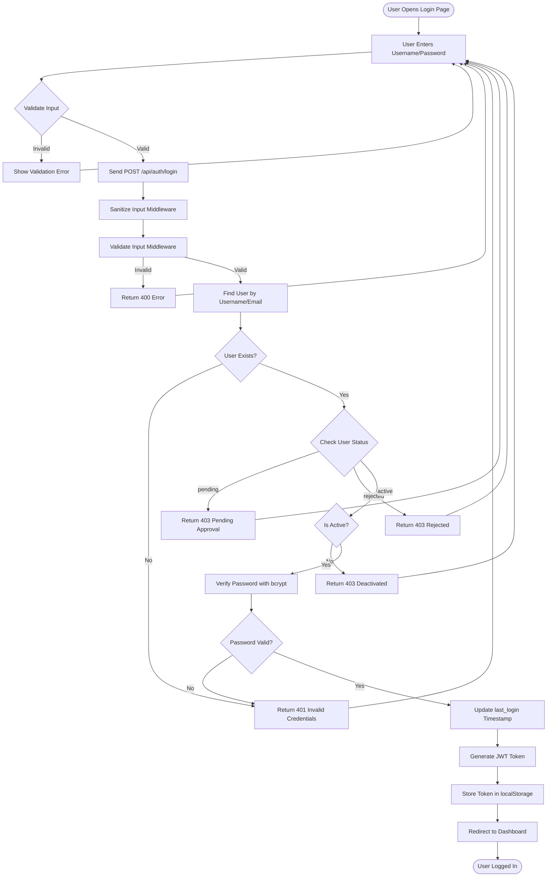

### Signup Request Flow

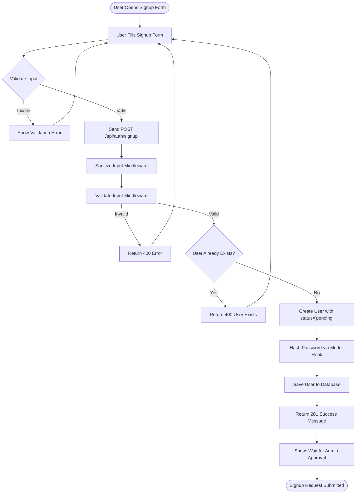

### Logout Flow

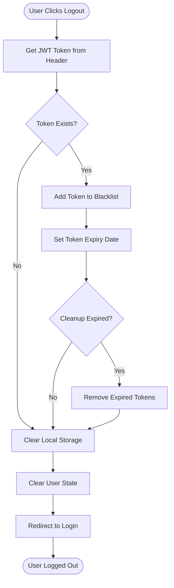

---

## Order Management Flow

### Create Order Flow

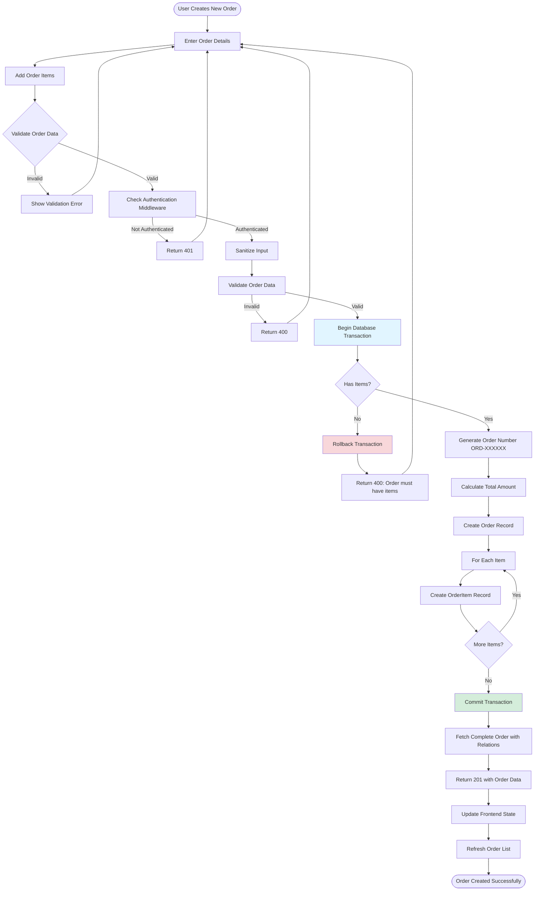

### Update Order Flow

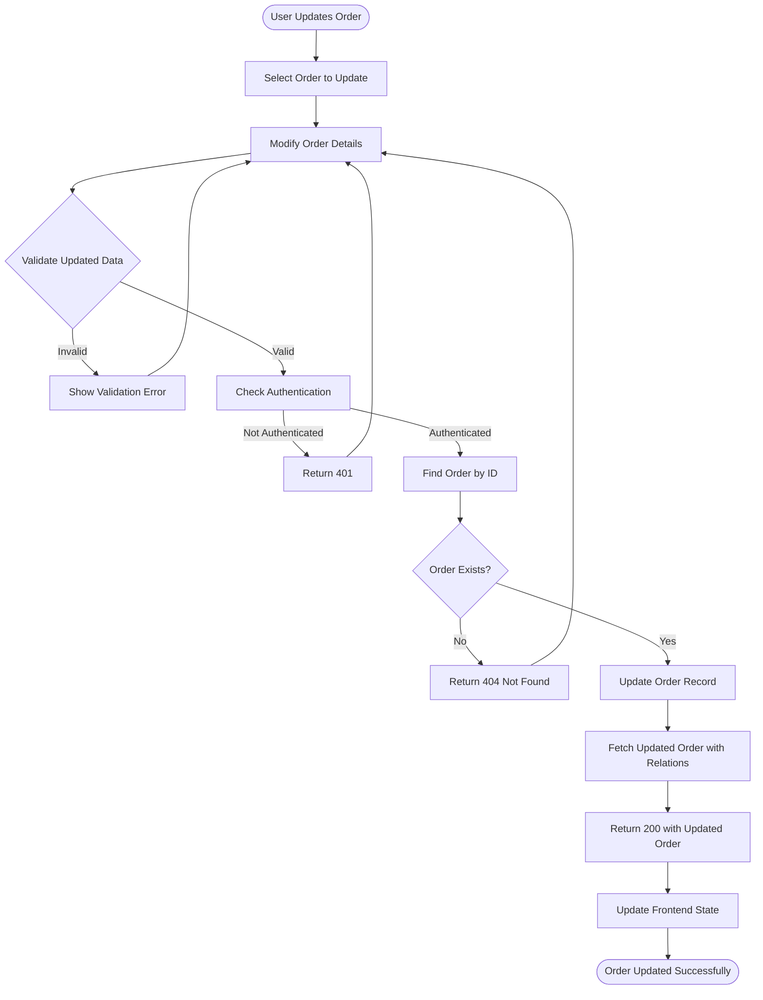

### Order Status Flow

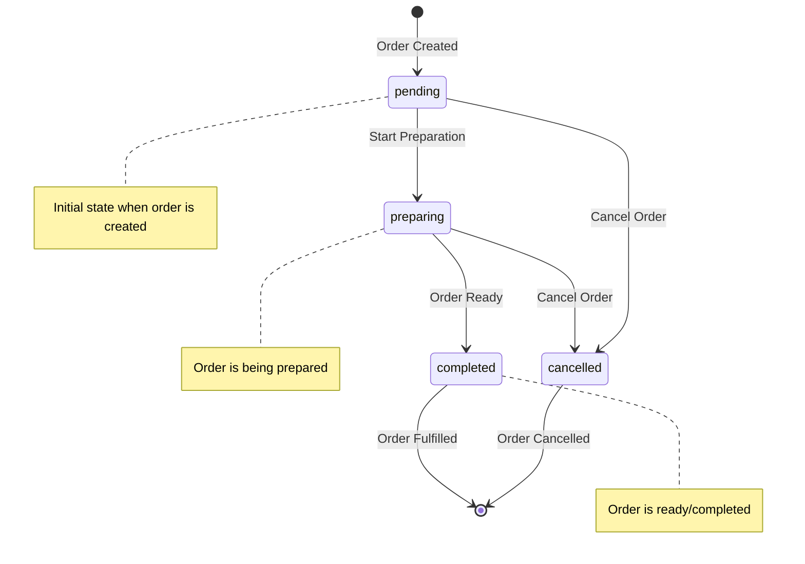

---

## Product Management Flow

### Add Product Flow

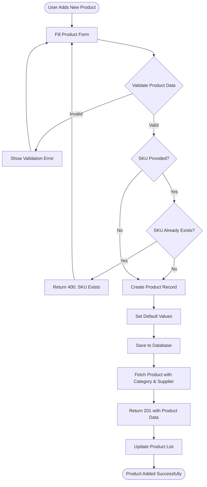

### Product Stock Management Flow

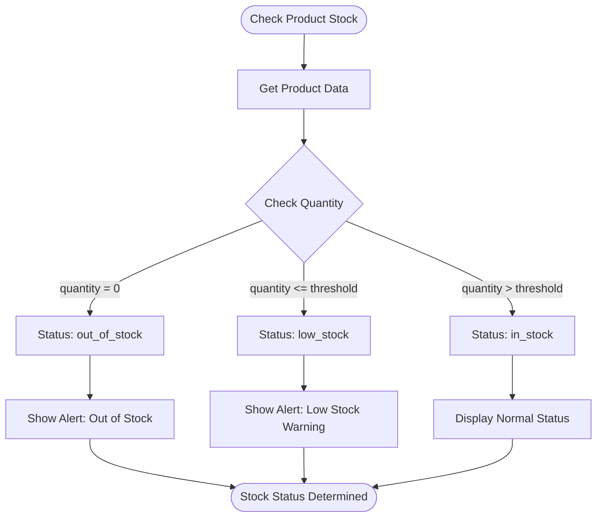

---

## Request Processing Flow

### API Request Middleware Chain

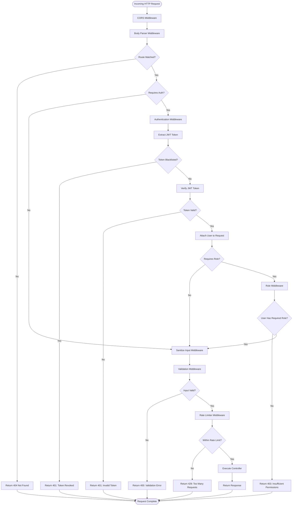

### Authentication Middleware Detailed Flow

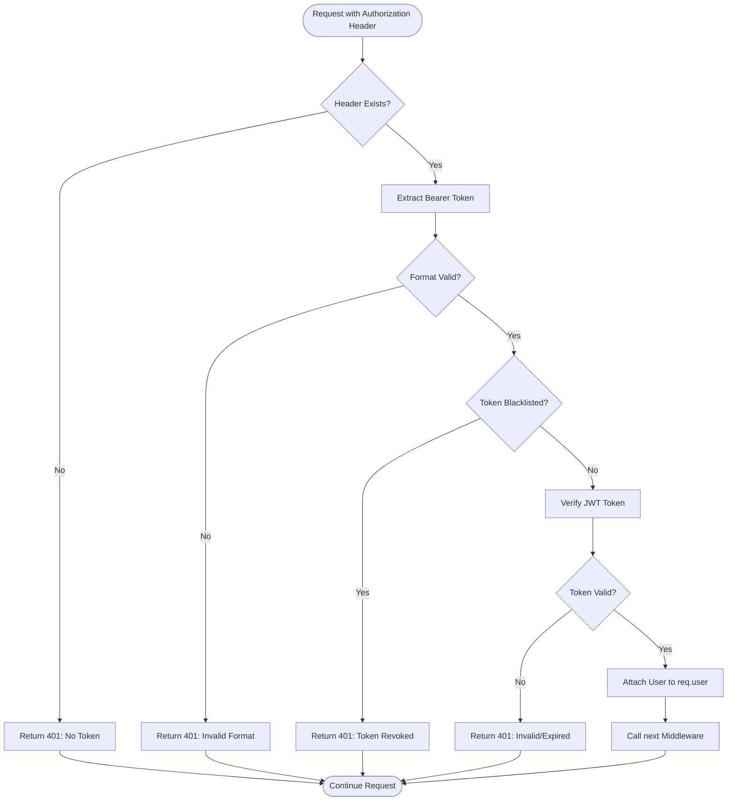

---

## Application Navigation Flow

### Frontend Router Flow

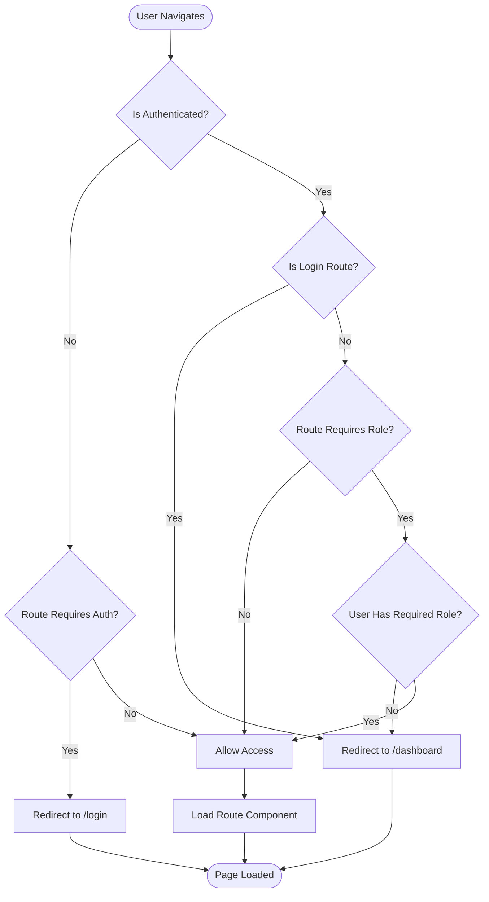

### Role-Based Access Control

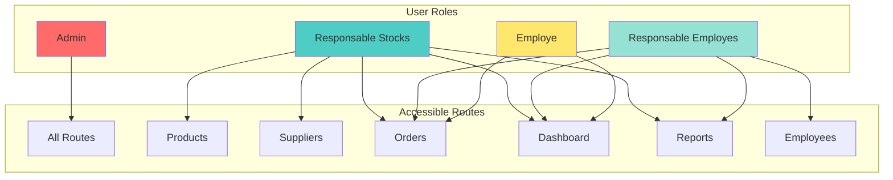

---

## Order Processing Workflow

### Complete Order Lifecycle

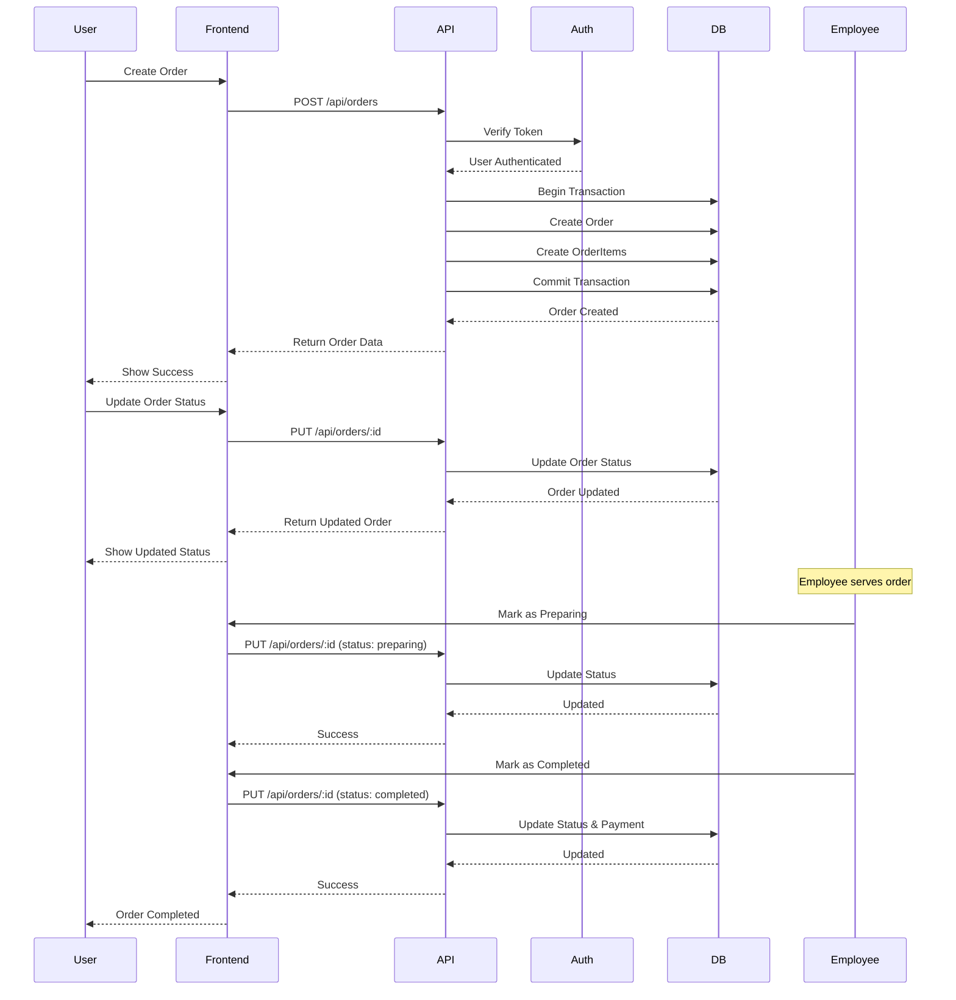

---

## Database Transaction Flow

### Order Creation with Transaction

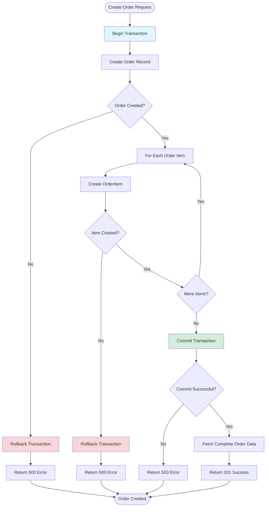

---

## Notes

### Key Points:

1. **Authentication**: All protected routes require JWT token validation
2. **Authorization**: Role-based access control (RBAC) is enforced at route level
3. **Data Validation**: Input sanitization and validation occur at multiple layers
4. **Transaction Safety**: Critical operations use database transactions
5. **Error Handling**: Comprehensive error handling at each layer
6. **Security**: Token blacklisting, rate limiting, and input sanitization

### Status Enums:

- **User Status**: `pending`, `active`, `inactive`, `rejected`
- **Order Status**: `pending`, `preparing`, `completed`, `cancelled`
- **Payment Status**: `unpaid`, `paid`, `refunded`
- **Employee Status**: `active`, `inactive`, `on_leave`
- **Product Stock Status**: `out_of_stock`, `low_stock`, `in_stock`

