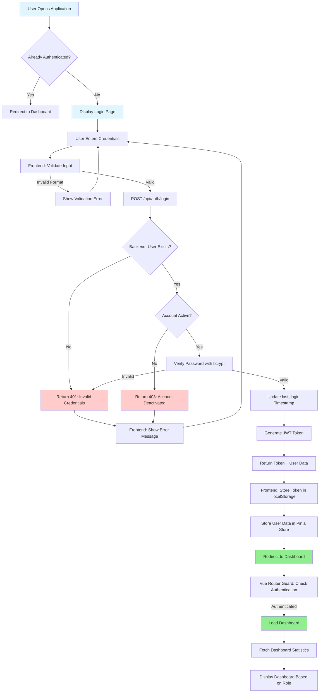
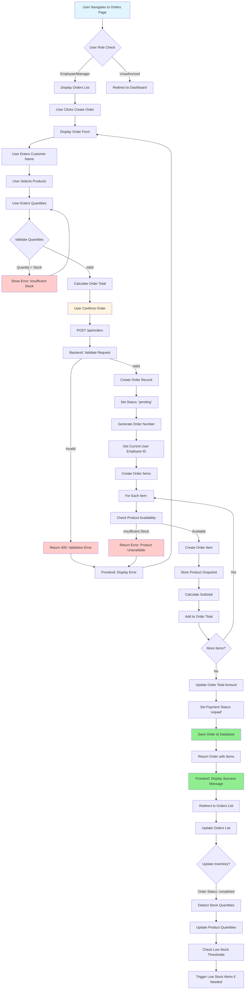
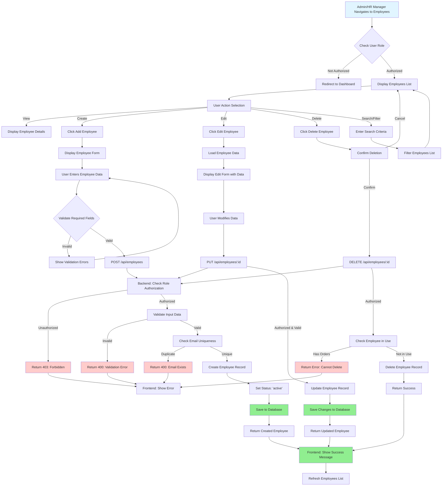
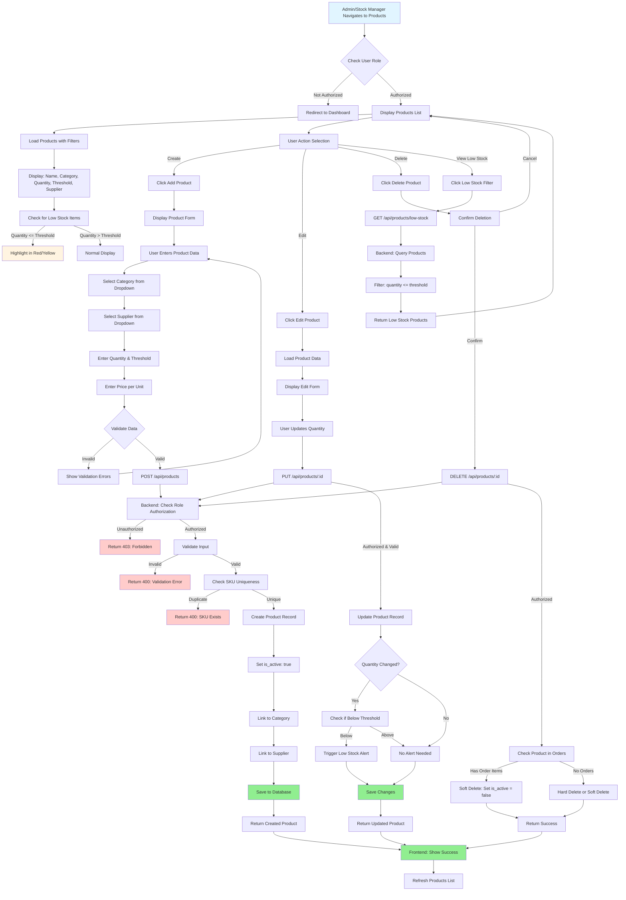
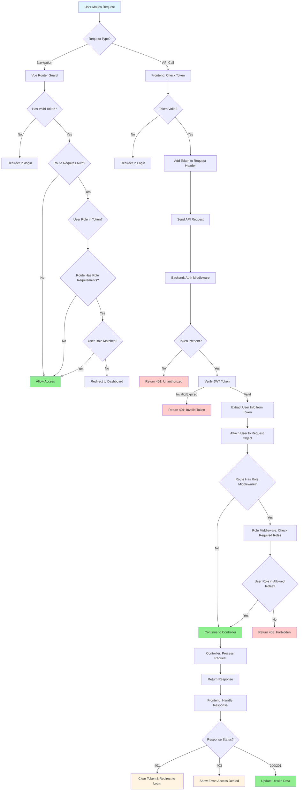
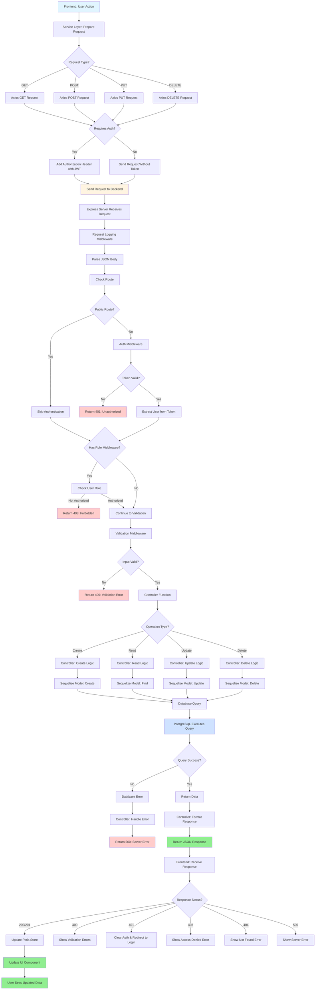
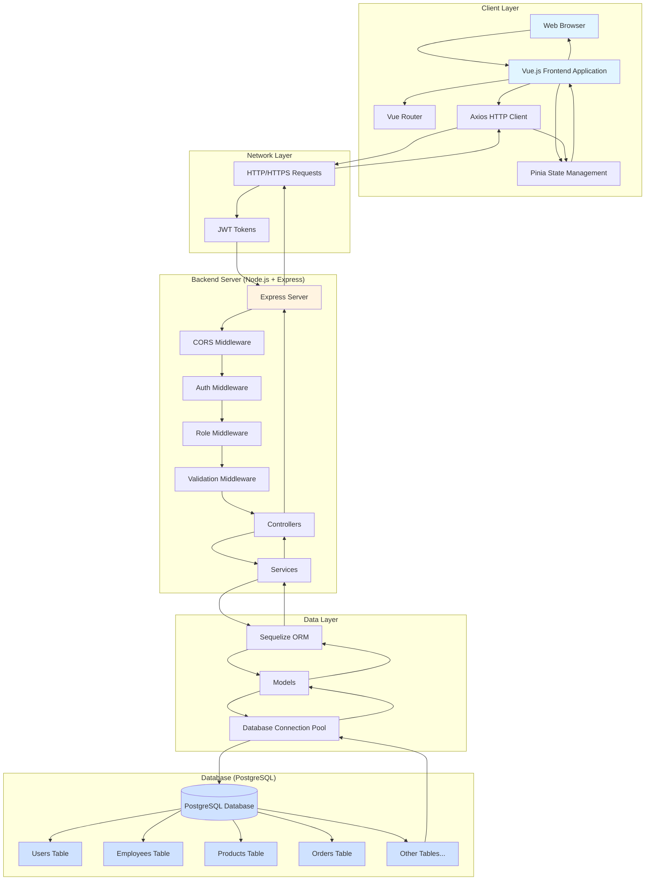
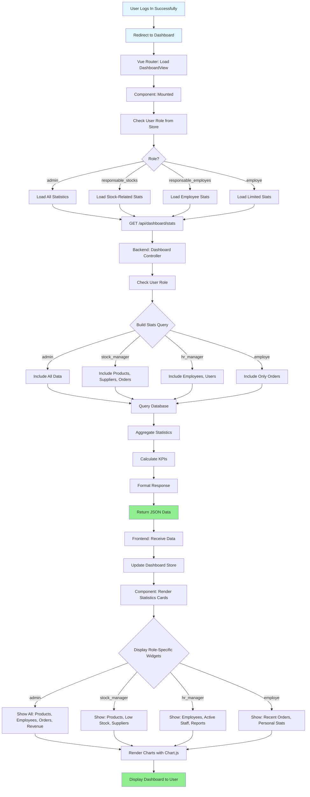

# ServUp v2.0 - Workflow Diagrams

This document contains flowcharts and workflow diagrams for the main processes in ServUp v2.0. These diagrams are essential for understanding the system's operation and are required for the academic project report.

---

## 1. User Authentication and Login Workflow

This flowchart shows the complete user authentication process, from initial login attempt to successful authentication and token management.

---

## 2. Order Creation Workflow

This flowchart illustrates the complete order creation and processing workflow, including inventory updates and payment tracking.

---

## 3. Employee Management Workflow (Admin/HR Manager)

This flowchart shows the employee management workflow including creation, updating, and deletion processes with role-based access control.

---

## 4. Product Management Workflow (Admin/Stock Manager)

This flowchart illustrates the product and inventory management process, including stock tracking, low-stock alerts, and supplier relationships.

---

## 5. Role-Based Access Control (RBAC) Workflow

This flowchart demonstrates how the system enforces role-based access control at both frontend and backend levels.

---

## 6. API Request Processing Flow

This flowchart shows the complete flow of an API request from frontend to database and back, including validation, authentication, and error handling.

---

## 7. System Architecture Flow

This flowchart illustrates the overall system architecture and data flow between different layers of the application.

---

## 8. Dashboard Data Loading Workflow

This flowchart shows how the dashboard loads and displays data based on user roles.

---

## How to Use These Diagrams

### For Academic Report

1. **Copy the Mermaid code** from each diagram
2. **Use a Mermaid renderer** such as:
   - [Mermaid Live Editor](https://mermaid.live/) - Online tool
   - VS Code with Mermaid extension
   - GitHub/GitLab (renders Mermaid automatically)
   - Include in LaTeX/Word documents (convert to image first)

### Converting to Images

1. **Online Conversion:**
   - Go to [Mermaid Live Editor](https://mermaid.live/)
   - Paste the Mermaid code
   - Click "Export" → Save as PNG/SVG

2. **VS Code:**
   - Install "Markdown Preview Mermaid Support" extension
   - Preview the markdown file
   - Right-click diagram → Save as image

3. **Command Line:**
   - Install Mermaid CLI: `npm install -g @mermaid-js/mermaid-cli`
   - Convert: `mmdc -i diagram.mmd -o diagram.png`

### Including in Report

- **Figure 1:** User Authentication and Login Workflow
- **Figure 2:** Order Creation Workflow
- **Figure 3:** Employee Management Workflow
- **Figure 4:** Product Management Workflow
- **Figure 5:** Role-Based Access Control Workflow
- **Figure 6:** API Request Processing Flow
- **Figure 7:** System Architecture Flow
- **Figure 8:** Dashboard Data Loading Workflow

---

**Document Version:** 1.0  
**Last Updated:** December 2024  
**Author:** ServUp Development Team

